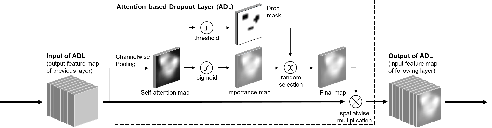

## Attention-based Dropout Layer for Weakly Supervised Object Localization


[Attention-based Dropout Layer for Weakly Supervised Object Localization](https://arxiv.org/abs/1908.10028)  
Junsuk Choe, and Hyunjung Shim  
School of Integrated Technology, Yonsei University


Weakly Supervised Object Localization (WSOL) techniques learn the object 
location only using image-level labels, without location annotations. A common 
limitation for these techniques is that they cover only the most discriminative 
part of the object, not the entire object. To address this problem, we propose 
an Attention-based Dropout Layer (ADL), which utilizes the self-attention 
mechanism to process the feature maps of the model. The proposed method is 
composed of two key components: 1) hiding the most discriminative part from the 
model for capturing the integral extent of object, and 2) highlighting the 
informative region for improving the recognition power of the model. Based on 
extensive experiments, we demonstrate that the proposed method is effective to 
improve the accuracy of WSOL, achieving a new state-of-the-art localization 
accuracy in CUB-200-2011 dataset. We also show that the proposed method is much 
more efficient in terms of both parameter and computation overheads than 
existing techniques.  

</img>

__ADL block diagram.__ The self-attention map is generated by channelwise average 
pooling of the input feature map. Based on the self-attention map, we produce a 
drop mask using thresholding and an importance map using a sigmoid activation,
respectively. The drop mask and the importance map are selected stochastically 
at each iteration and applied to the input feature map. Please note that this figure
illustrates the case when the importance map is selected.

## Getting Started

Tensorpack implementation of Attention-Dropout Layer for Weakly Supservised Object Localization.  
PyTorch implementation is available at: [link](https://github.com/clovaai/wsolevaluation)

Our implementation is based on these repositories:
- [Tensorpack Saliency Example](https://github.com/tensorpack/tensorpack/tree/master/examples/Saliency)
- [Tensorpack ImageNet Example](https://github.com/tensorpack/tensorpack/tree/master/examples/ImageNetModels)

Imagenet Pre-trained models can be downloaded here:
- [Tensorpack Models](http://models.tensorpack.com/)


### Requirements
- Python 3.3+
- Python bindings for OpenCV.
- Tensorflow (≥ 1.12, < 2)

### Prepare datasets
#### ImageNet
To prepare ImageNet data, download ImageNet "train" and "val" splits from 
[here](http://www.image-net.org/) and put the downloaded file on 
`dataset/ILSVRC2012_img_train.tar` and `dataset/ILSVRC2012_img_val.tar`.

Then, run the following command on `root` directory to extract the images. 
```
./dataset/prepare_imagenet.sh
```
`apt-get install parallel` may be required to install [parallel](https://www.gnu.org/software/parallel/).

The structure of image files looks like
```
dataset
└── ILSVRC
    └── train
        └── n01440764
            ├── n01440764_10026.JPEG
            ├── n01440764_10027.JPEG
            └── ...
        └── n01443537
        └── ...
    └── val
        ├── ILSVRC2012_val_00000001.JPEG
        ├── ILSVRC2012_val_00000002.JPEG
        └── ...
```
Corresponding annotation files can be found in [here](labels/ILSVRC).

#### CUB

Run the following command to download original CUB dataset and extract the image 
files on `root` directory.

```
./dataset/prepare_cub.sh
```

The structure of image files looks like
```
dataset
└── CUB
    └── 001.Black_footed_Albatross
        ├── Black_Footed_Albatross_0001_796111.jpg
        ├── Black_Footed_Albatross_0002_55.jpg
        └── ...
    └── 002.Laysan_Albatross
    └── ...
```
Corresponding annotation files can be found in [here](labels/CUB).

### Training script

First download pretrained models from [here](http://models.tensorpack.com/). 
Currently, we provide [ResNet50-SE](http://models.tensorpack.com/ResNet/ImageNet-ResNet50-SE.npz) 
and [VGG-16](http://models.tensorpack.com/Caffe-Converted/vgg16.npz) networks.  
Then, run the following command on `root` directory.
```
./run_train.sh
```
